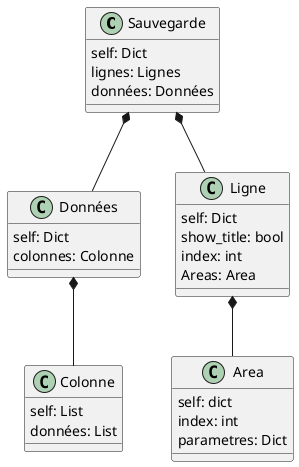

# Projet-Dashboard

## Système de sauvegarde

```plantuml
@startuml

Sauvegarde *-- Données
Sauvegarde *-- Ligne
Données *-- Colonne
Ligne *-- Area

class Sauvegarde {
    self: Dict
    lignes: Lignes
    données: Données
}

class Données {
    self: Dict
    colonnes: Colonne
}

class Colonne {
    self: List
    données: List
}

class Ligne {
    self: Dict
    show_title: bool
    index: int
    Areas: Area
}

class Area {
    self: dict
    index: int
    parametres: Dict
}

@enduml
```
